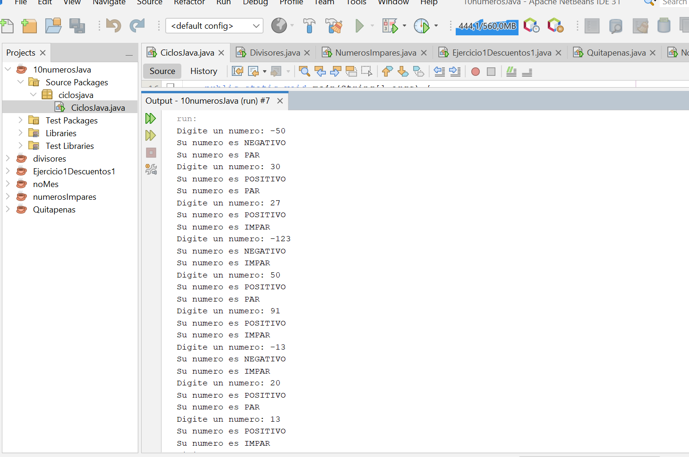
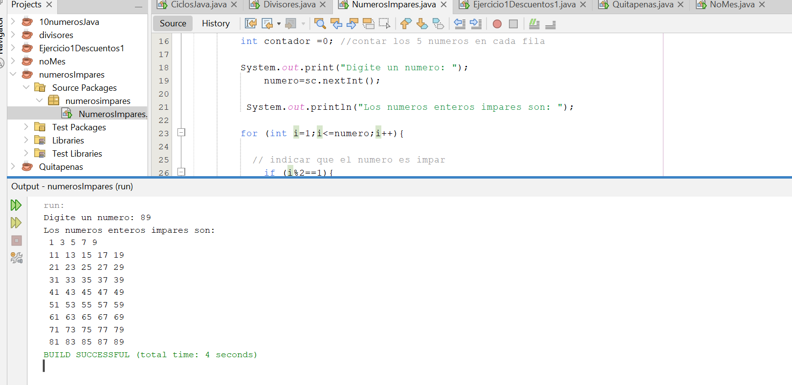
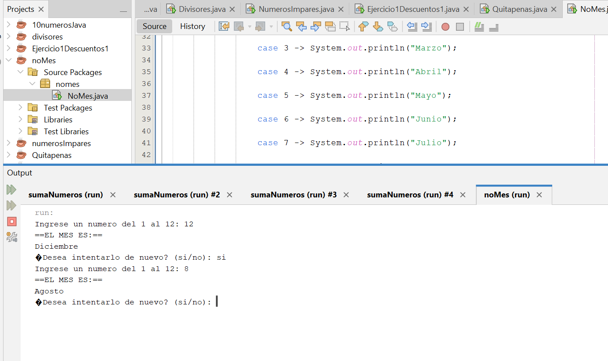
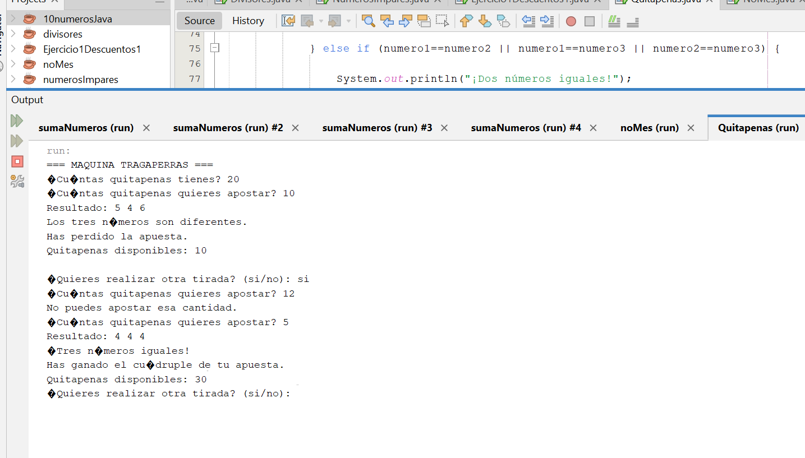

# Java-Ciclos

## 1. Mi informacion
* **Nombre Completo:** Lizeth Mariana Cotrino Ossa
* **Programa Académico:** Tecnologiaa en Desarrollo de Software
* **Fecha de Entrega** 03 de Septiembre de 2026
---
## Ejercicios Iniciales

### Ejercicio No.1
Enunciado:  Pedir por teclado 10 números e indicar si cada uno de ellos es positivo o negativo y si es par o impar.

### Conclusión:
Cuando se ejecuta el código hace bien su trabajo, utilicé el bucle for ya que sabía cuantos números iba ingresar el usuario lo cuál este fue la mejor opción y también como se muestra en el ejercicio se utiliza el if- else para unas condiciones que se menciona en el enunciado como decir si el numero es par/impar o si era positivo/negativo. No fue complicado hacerlo ya que son cosas parecidas que ya hemos visto anteriormente.

### Ejercicio No.2
Enunciado: Hacer un programa que lea un número entero por teclado y escriba los números enteros impares que
hay desde el 1 hasta el número leído (éste incluido), pero escribiendo solo 5 números por línea.

### Conclusión
este ejercicio permite comprender mejor cómo utilizar los ciclos for y las condiciones if. El programa recorre los números desde el 1 hasta el número ingresado por el usuario y, mediante el operador %, identifica cuáles son impares para mostrarlos en pantalla. También se utilizó  un contador para llevar las cuentas de los 5 números en cada línea como se menciona en el enunciado.

---

## Ejercicios Intermedios

### Ejercicio No.1
Enunciado: Hacer un programa que pide un número al usuario,  y escribe en pantalla el mes correspondiente a tal número (si el usuario introduce  2, el programa escribe “Febrero”).  Si el numero no es válido, lo indica igualmente. Tras ello, se le pregunta al usuario si quiere repetir, y si dice “si”, se vuelve a repetir el proceso anterior.

### Conclusión
Al ejecutarlo permite identificar el mes correspondiente a un número del 1 al 12 utilizando una estructura switch. Además, mediante el ciclo while, el usuario puede repetir el proceso las veces que quiera, y si introduce un número fuera del rango, el programa informa que no es válido.

### Ejercicio No.2
Enunciado: Vamos a escribir un programa que simule una máquina tragaperras mejorada. Las apuestas no son
con dinero sino con fichas llamadas “quitapenas”. El funcionamiento del juego debe ser el siguiente:
* El jugador indica cuántas “quitapenas” se quiere jugar.
* El programa mostrará tres números al azar entre el 1 y el 6.
* Si los tres números son distintos → el jugador pierde todas sus “quitapenas”.
* Si los tres números son 6 (6 6 6) → el jugador pierde todas sus “quitapenas” por ser “el número
del demonio”.
* Si salen dos números iguales → el jugador obtiene tantas “quitapenas” como hubiera apostado.
* Si salen tres números iguales, que no sea la combinación 6 6 6 → el jugador gana el cuadruple de lo
que había apostado .
* El jugador debe indicar si quiere realizar otra tirada → esta será posible siempre que al
jugador le queden “quitapenas”. Si no le quedan se mostrará un mensaje de error indicando que
no tiene “quitapenas” para jugar.
* El jugador debe indicar si quiere finalizar el juego → En ese momento se informará de las
“quitapenas” que tiene y de cuántas ha ganado (las que tenga menos las que haya ido apostando).

### Conclusión
Este permite simular una máquina tragaperras utilizando números aleatorios y diferentes condiciones para determinar si el jugador gana o pierde quitapenas. Fue el más difícil, especialmente por tener que combinar el ciclo while con varias condiciones y actualizar correctamente la cantidad de quitapenas después de cada tirada. Al final de todo creo que se logró

### Ejercicio No.3
Enunciado: Realizar un programa que pida al usuario 10 números. Debe calcular el resultado de sumar los números introducidos que sean mayores que el primer numero introducido . 
1[Evidencia Ejercicio3](EVIDENCIAS/Nueva carpeta/Eje3N.Inter.png)
### Conclusión 
